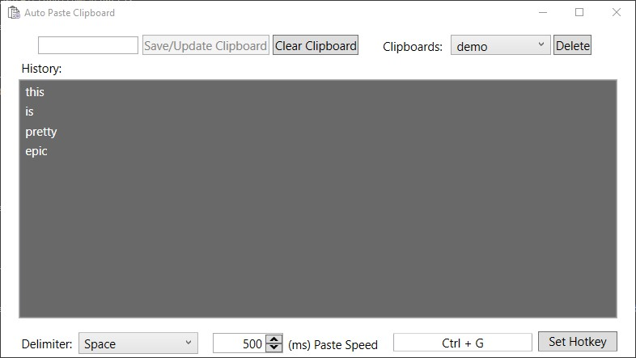

# Auto Paste Clipboard
This application paste all text data from your clipboard history individually with an optional pasting delimiter. Ideal for pasting a set of information onto a form or redeeming multiple coupon codes.
You can use tab, enter, space, comma, period, or a combination of space with comma or period as a delimeter which will be pressed after each time the application does a pasting operation. You can also save, clear, update, delete, load, or undo the changes of a clipboard profile. Use ***Ctrl + Delete*** to cancel a pasting operation. The list view updates whenever there's a change in clipboard history.

